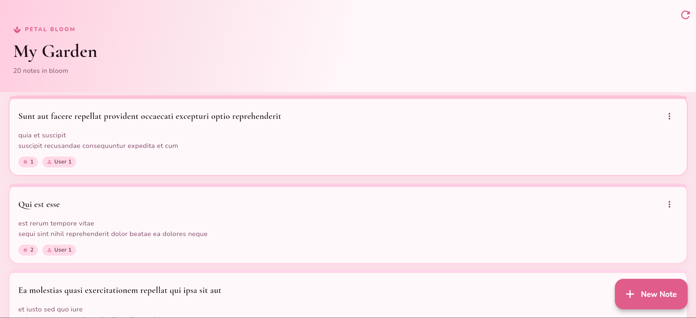
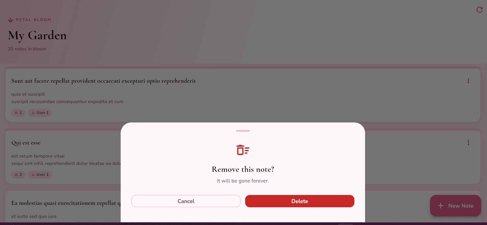
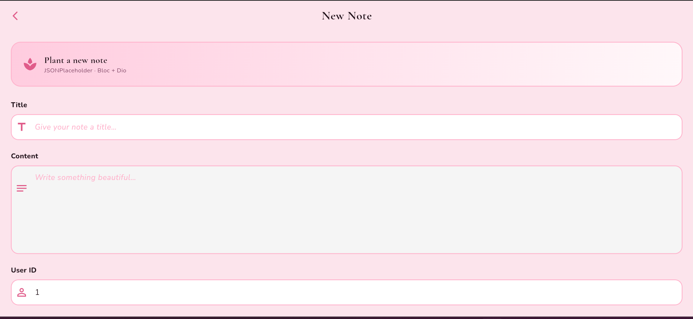
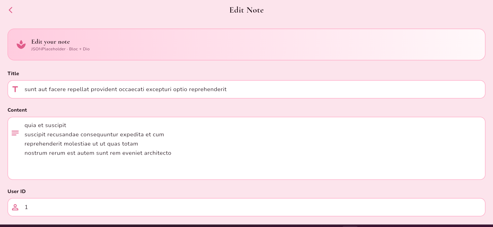
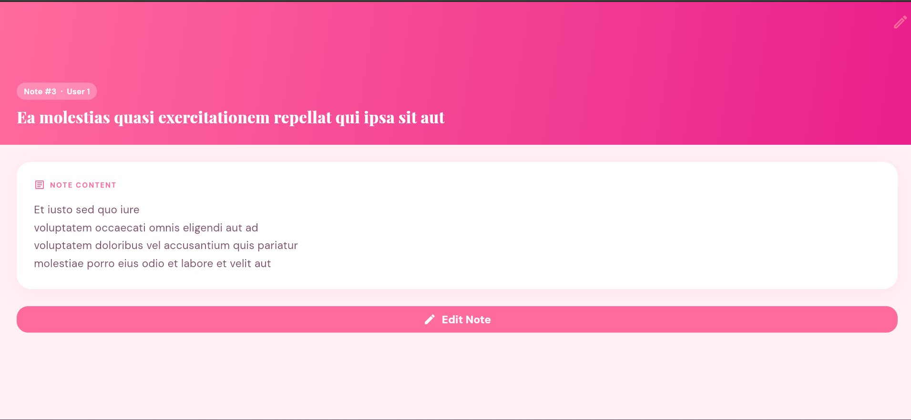
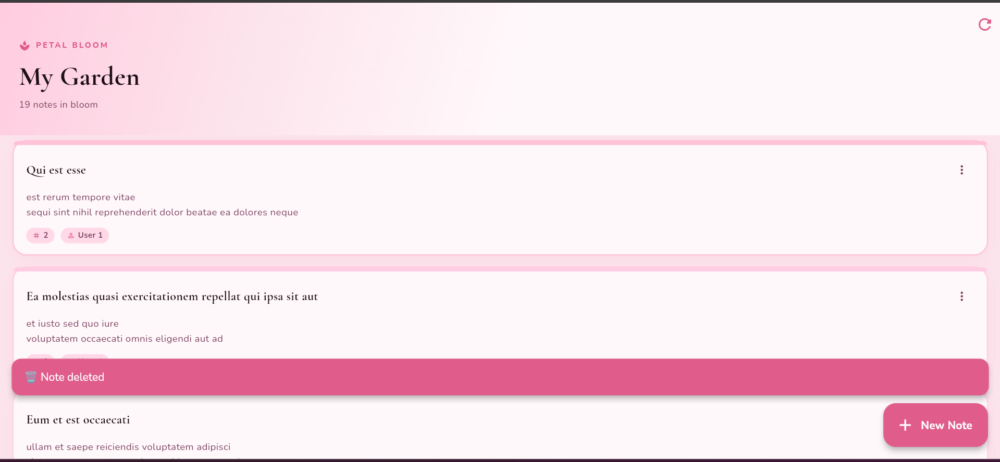
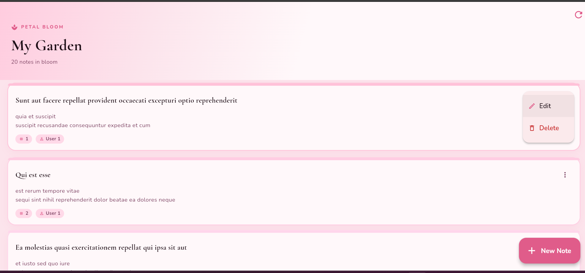

# 🌺 Petal Bloom

A Flutter journaling app that performs full CRUD operations using the [JSONPlaceholder](https://jsonplaceholder.typicode.com) REST API — built with **flutter_bloc** state management and the **Dio** HTTP client.

---

## ✨ Features

| Feature | Description |
|---|---|
| 🌺 **Create** | Add new notes via a clean form screen |
| 📖 **Read** | Browse staggered note cards + tap to view full detail |
| ✏️ **Update** | Edit title, content, and user ID of any note |
| 🗑️ **Delete** | Remove notes with a bottom-sheet confirmation |
| 🔄 **Refresh** | Re-fetch all notes from the API |
| ⚠️ **Error handling** | Typed Dio error handling with retry |
| ⏳ **Loading / Mutating states** | Distinct UI for fetch vs CRUD operations |

---

## 📁 Project Structure

```
lib/
├── main.dart                    # App entry, BlocProvider
├── theme/
│   └── app_theme.dart           # Mauve-rose Material 3 theme
├── models/
│   └── post.dart                # Post model + Equatable
├── services/
│   └── api_service.dart         # Dio client with interceptors + CRUD
├── bloc/
│   ├── post_bloc.dart           # PostBloc (on<Event> handlers)
│   ├── post_event.dart          # Fetch / Create / Update / Delete events
│   └── post_state.dart          # Initial / Loading / Loaded / Mutating / Error
├── screens/
│   ├── home_screen.dart         # BlocConsumer + BlocBuilder list view
│   ├── detail_screen.dart       # Full note detail screen
│   └── add_edit_screen.dart     # BlocListener form (create & update)
└── widgets/
    ├── bloom_card.dart          # Staggered card with top ribbon + popup menu
    └── bloom_widgets.dart       # BloomLoader, BloomError, BloomEmpty
```

---

## 🛠️ Tech Stack

- **Flutter** (Dart)
- **flutter_bloc `^8.1.6`** — BLoC pattern state management
- **bloc `^8.1.4`** — core bloc library
- **dio `^5.7.0`** — HTTP client with interceptors
- **equatable `^2.0.5`** — value equality for states/events
- **google_fonts `^6.2.1`** — Cormorant Garamond + Nunito typography
- **JSONPlaceholder** — free fake REST API

---

## 🔄 Bloc Flow

```
UI Event ──► PostBloc ──► ApiService (Dio) ──► Emit State ──► UI rebuilds
```

Events: `FetchPostsEvent`, `CreatePostEvent`, `UpdatePostEvent`, `DeletePostEvent`

States: `PostInitial` → `PostLoading` → `PostLoaded` → `PostMutating` → `PostMutationSuccess` / `PostError`

---

## 🚀 Getting Started

```bash
flutter pub get
flutter run
```

> Requires Flutter 3.x and Dart ≥ 3.0.0

---

## 🌐 API Reference

All requests go to `https://jsonplaceholder.typicode.com/posts`.

| Method | Endpoint | Action |
|---|---|---|
| GET | `/posts?_limit=20` | Fetch notes |
| POST | `/posts` | Create note |
| PUT | `/posts/:id` | Update note |
| DELETE | `/posts/:id` | Delete note |

---

## 📸 Screenshots

| Home | Delete Confirmation | 
|------|-------------------|
|  |  | 

| Add Product | Edit Product |
|-------------|--------------|
|  |  |


| Show Notes  | Note Deleted| Show Menu | 
|-------------|--------------|--------------|
|   |  |  | 

## Student Information

- Name: Menal Abdulkadir
- ID: UGR/7907/16
- Section: 1


